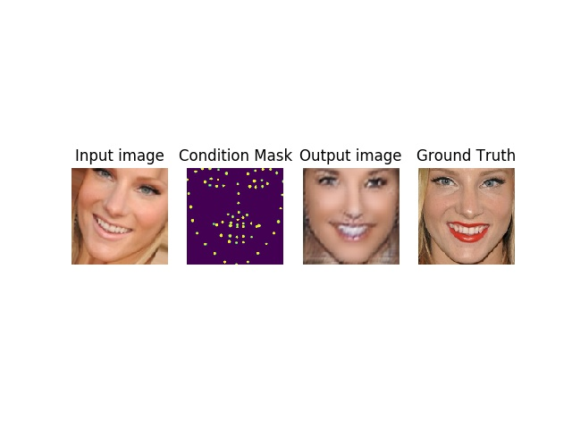
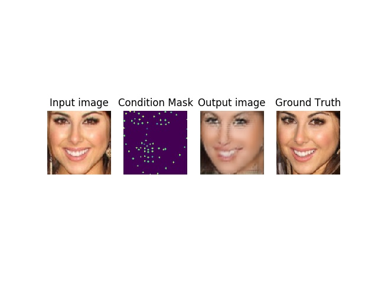

# Face-Pose-Translation-GAN
GAN-based face pose translation

Faces are translated from a reference and conditioned by a mask of landmarks. The generator is a UNet and the training methodology is a GAN-based-pix2pix-lookalike. Nothing fancy.

## Results

Some samples from training:

